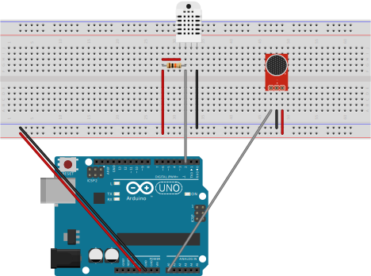

# arduino-sensors-toolkit

This toolkit has been designed to be used with a DHT22 (humidity, temperature) and KY-037 (sound) sensors connected to
an Arduino microcontroller. It is part of a self hosting project with specific needs. Feel free to fork this repository
and update code for your needs.

## sensors2serial

Arduino circuit:



## serial2mqtt

### Requirements

- serial interface using sensors2serial code (ex: /dev/cuaU0 for FreeBSD, /dev/ttyACM0 for Debian)
- MQTT broker (ex: [Mosquitto](https://www.digitalocean.com/community/tutorials/how-to-install-and-secure-the-mosquitto-mqtt-messaging-broker-on-debian-10))

### Installation

- Installation on [Debian](debian/README.md)
- Installation on [FreeBSD](freebsd/README.md)

### Configuration

An optional configuration file can be used with `--config <file>`. See [serial2mqtt.ini.example](serial2mqtt.ini.example).

### Usage

```
python3 serial2mqtt.py --help
```
